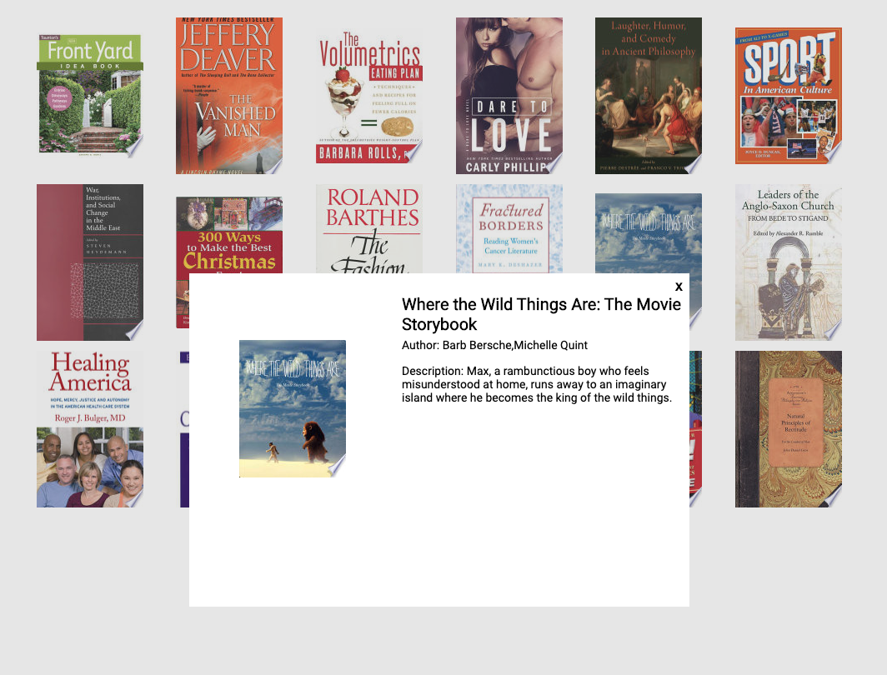

## Google Book API Modal Project
_____________

__Deployed Project__
https://cpassafaro.github.io/UI-Element-Project/

__Sample__
***

__Project Description__
This project uses the api google books to preload certain topics into the gird elements. When the images are clicked on a modal pops up giving the user the title of the book, author, and a description of the book. All information is populated via the api. Different genres are searched to provide a unique tile. When modal is open users are unable to click on background because of z-index usage.

__Languages__
Languages used are html, css, and javascript.
